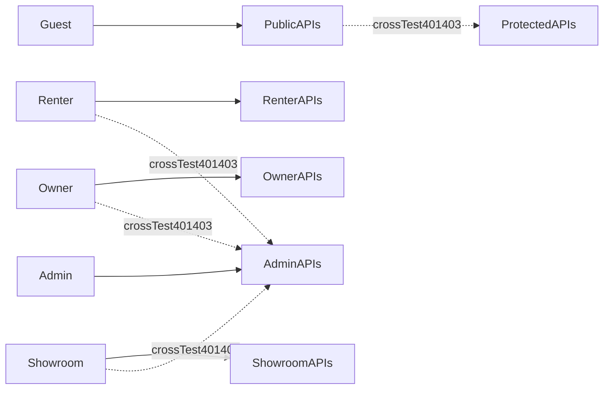

# Lộ trình kiểm thử cho buổi bảo vệ luận án (SmartRent)

## Mục lục

1. [Mục tiêu và phạm vi](#1-muc-tieu-va-pham-vi)
2. [Chuẩn bị môi trường test](#2-chuan-bi-moi-truong-test)
3. [Smoke test P0](#3-smoke-test-p0)
4. [Functional test theo module](#4-functional-test-theo-module)
5. [Ma trận phân quyền](#5-ma-tran-phan-quyen-authorization-matrix)
6. [Security checklist OWASP rút gọn](#6-security-checklist-owasp-rut-gon)
7. [Validation và boundary test](#7-validation-va-boundary-test)
8. [Compatibility, responsive, accessibility](#8-compatibility-responsive-accessibility)
9. [Performance manual](#9-performance-manual)
10. [Regression và UAT](#10-regression-va-uat)
11. [Bug log mẫu](#11-bug-log-mau)
12. [Lịch trình 5 ngày và checklist nộp luận án](#12-lich-trinh-5-ngay-va-checklist-nop-luan-an)

## 1. Mục tiêu và phạm vi

- Mục tiêu: kiểm tra toàn diện để khóa lỗi chức năng, lỗi phân quyền, lỗi thanh toán, lỗi bảo mật trước buổi bảo vệ.
- Phạm vi hệ thống: backend Node/Express + Mongo + JWT/session + Stripe + Cloudinary và frontend React đa vai trò.
- Tài liệu tham chiếu chính:
  - [backend/src/app.js](backend/src/app.js)
  - [frontend/src/App.js](frontend/src/App.js)
  - [backend/src/models/user.model.js](backend/src/models/user.model.js)
  - [backend/src/models/booking.model.js](backend/src/models/booking.model.js)
- Vai trò cần test:
  - `guest`
  - `renter`
  - `owner`
  - `showroom`
  - `admin`

### Tiêu chí Pass/Fail (Exit Criteria)

- 100% test-case P0 phải Pass.
- Tối thiểu 95% test-case P1 Pass.
- Không còn bug mức `Critical` hoặc `High` ở trạng thái Open/Retest Fail.
- Có biên bản test đầy đủ: ngày test, người test, môi trường, bằng chứng ảnh/video.

### Ma trận mức độ nghiêm trọng bug

| Mức độ | Định nghĩa | Ví dụ |
| --- | --- | --- |
| Critical | Không thể demo core flow, mất dữ liệu, sai tiền thanh toán | Confirm payment sai booking |
| High | Chức năng chính lỗi hoặc sai phân quyền nghiêm trọng | Renter gọi API admin thành công |
| Medium | Chức năng phụ lỗi, workaround khó chịu | Lọc xe sai khi nhiều điều kiện |
| Low | Lỗi hiển thị nhẹ, không ảnh hưởng nghiệp vụ chính | Label lệch layout |
| Cosmetic | Lỗi giao diện/viết sai chính tả | Chính tả toast/message |

## 2. Chuẩn bị môi trường test

### 2.1 Môi trường

- Backend chạy được bằng `npm run dev` tại `backend`.
- Frontend chạy được bằng `npm start` tại `frontend`.
- Dùng database dữ liệu test riêng, không dùng dữ liệu thật.
- Bật logging backend để đối chiếu lỗi (morgan + console error).

### 2.2 Tài khoản test chuẩn

| Mã tài khoản | Role | Trạng thái | Mục đích |
| --- | --- | --- | --- |
| ACC-ADMIN-01 | admin | active | Duyệt showroom, quản trị users |
| ACC-SHOW-APP-01 | showroom | approved | Luồng vận hành showroom |
| ACC-SHOW-PEN-01 | showroom | pending | Kiểm tra chặn quyền khi chưa duyệt |
| ACC-SHOW-REJ-01 | showroom | rejected | Kiểm tra luồng bị từ chối |
| ACC-OWNER-01 | owner | active | Quản lý xe/doanh thu owner |
| ACC-RENTER-01 | user/renter | active | Luồng thuê xe end-to-end |
| ACC-RENTER-02 | user/renter | active | Cross-check data ownership |

### 2.3 Dữ liệu test chuẩn bị

- Tối thiểu 5 xe đang active và 2 xe inactive.
- Tối thiểu 3 showroom approved có xe.
- Booking có đủ các trạng thái trong [backend/src/models/booking.model.js](backend/src/models/booking.model.js):
  - `pending`, `confirmed`, `cancelled`, `cancel_pending`, `cancel_failed`, `completed`
  - `waiting_payment`, `paid`, `waiting_handover`, `handed_over`, `in_use`, `waiting_return_confirmation`
- Bộ ảnh test upload:
  - Hợp lệ: `.jpg`, `.png` (dung lượng thấp và cao).
  - Không hợp lệ: `.svg`, `.zip`, `.exe`, file rỗng, file giả mạo extension.

### 2.4 Stripe test data

- Thẻ thành công: `4242 4242 4242 4242`
- Thẻ decline: `4000 0000 0000 9995`
- Thẻ yêu cầu xác thực: `4000 0027 6000 3184`
- Kiểm tra cả flow success, failed, retry, refund.

### 2.5 Ma trận thiết bị trình duyệt

| Thiết bị | Kích thước | Browser |
| --- | --- | --- |
| Desktop | 1440x900 | Chrome, Firefox, Edge |
| Tablet | 768x1024 | Chrome |
| Mobile | 360x800 | Chrome |

## 3. Smoke test P0

Thực hiện trước mỗi lần build demo.

| ID | Module | Tiền điều kiện | Bước test | Kết quả mong đợi |
| --- | --- | --- | --- | --- |
| TC-SMOKE-001 | Health | Backend up | GET `/api/health` | Trả `ok: true` |
| TC-SMOKE-002 | Auth | Có ACC-ADMIN-01 | Login admin | Nhận token hợp lệ |
| TC-SMOKE-003 | Auth | Có ACC-SHOW-APP-01 | Login showroom | Nhận token hợp lệ |
| TC-SMOKE-004 | Auth | Có ACC-OWNER-01 | Login owner | Nhận token hợp lệ |
| TC-SMOKE-005 | Auth | Có ACC-RENTER-01 | Login renter | Nhận token hợp lệ |
| TC-SMOKE-006 | Routing | Token admin | Mở `/admin/dashboard` | Render bình thường |
| TC-SMOKE-007 | Routing | Token showroom | Mở `/showroom/vehicles` | Render bình thường |
| TC-SMOKE-008 | Routing | Token owner | Mở `/owner/dashboard` | Render bình thường |
| TC-SMOKE-009 | Routing | Token renter | Mở `/renter/dashboard` | Render bình thường |
| TC-SMOKE-010 | Vehicles | Có dữ liệu xe | Mở danh sách xe công khai | Có item hiển thị |
| TC-SMOKE-011 | Booking | Token renter | Tạo booking cơ bản | Booking tạo thành công |
| TC-SMOKE-012 | Payment | Booking waiting_payment | Thanh toán thẻ thành công | Trạng thái cập nhật |
| TC-SMOKE-013 | Contract | Có booking hợp lệ | Mở hợp đồng theo booking | Tải/hiển thị được |
| TC-SMOKE-014 | Map | Có tọa độ xe | Mở trang bản đồ | Marker/route hiển thị |
| TC-SMOKE-015 | Notification | Có event booking | Trigger event | Nhận thông báo mới |

## 4. Functional test theo module

Mẫu ghi kết quả thực thi:

| ID | Module | Tiền điều kiện | Bước | Dữ liệu | Kết quả mong đợi | Ưu tiên | Thực tế | Pass/Fail |
| --- | --- | --- | --- | --- | --- | --- | --- | --- |

### 4.1 Auth và Session

- Nhóm API: [backend/src/routes/auth.route.js](backend/src/routes/auth.route.js)
- Nhóm middleware: [backend/src/middlewares/auth.middleware.js](backend/src/middlewares/auth.middleware.js)

Test-case trọng tâm:

1. `TC-AUTH-001`: Register user mới email hợp lệ.
2. `TC-AUTH-002`: Register trùng email.
3. `TC-AUTH-003`: Register showroom với hồ sơ đầy đủ.
4. `TC-AUTH-004`: Login đúng email/password.
5. `TC-AUTH-005`: Login sai password.
6. `TC-AUTH-006`: Gọi `/auth/me` với token hợp lệ.
7. `TC-AUTH-007`: Gọi `/auth/me` với token thiếu prefix `Bearer`.
8. `TC-AUTH-008`: Token hết hạn.
9. `TC-AUTH-009`: Đổi mật khẩu đúng mật khẩu cũ.
10. `TC-AUTH-010`: Đổi mật khẩu sai mật khẩu cũ.
11. `TC-AUTH-011`: Login bằng mật khẩu mới sau đổi mật khẩu.
12. `TC-AUTH-012`: Danh sách sessions khi login nhiều thiết bị.
13. `TC-AUTH-013`: Token có `jti` nhưng session không tồn tại.
14. `TC-AUTH-014`: User bị inactive thì login/truy cập bị chặn.
15. `TC-AUTH-015`: Kiểm tra logout thủ công (nếu có) làm invalid session.

### 4.2 Profile theo role

1. `TC-PROFILE-001`: Renter cập nhật tên/sđt thành công.
2. `TC-PROFILE-002`: Owner cập nhật profile thành công.
3. `TC-PROFILE-003`: Showroom cập nhật `business_name`, `tax_code`.
4. `TC-PROFILE-004`: Upload/cập nhật `license_document_urls`.
5. `TC-PROFILE-005`: Admin cập nhật profile chính mình.
6. `TC-PROFILE-006`: Không cho sửa profile user khác qua IDOR.
7. `TC-PROFILE-007`: Validate format phone/email sai.
8. `TC-PROFILE-008`: Dữ liệu dài bất thường bị từ chối hợp lý.

### 4.3 Vehicle và Vehicle Location

1. `TC-VEH-001`: Tạo xe mới với dữ liệu hợp lệ.
2. `TC-VEH-002`: Thiếu trường bắt buộc.
3. `TC-VEH-003`: Giá âm hoặc bằng 0.
4. `TC-VEH-004`: Cập nhật thông tin xe.
5. `TC-VEH-005`: Xóa/ẩn xe khỏi danh sách công khai.
6. `TC-VEH-006`: Chỉ owner/showroom sở hữu mới được sửa xe.
7. `TC-VEH-007`: Cập nhật vị trí GPS hợp lệ.
8. `TC-VEH-008`: Vị trí sai định dạng.
9. `TC-VEH-009`: Upload ảnh xe hợp lệ.
10. `TC-VEH-010`: Upload ảnh vượt số lượng cho phép.

### 4.4 Search, Filter, Map

1. `TC-SEARCH-001`: Tìm xe theo địa chỉ.
2. `TC-SEARCH-002`: Lọc theo khoảng giá.
3. `TC-SEARCH-003`: Lọc kết hợp nhiều điều kiện.
4. `TC-SEARCH-004`: Không có kết quả.
5. `TC-SEARCH-005`: Mở bản đồ và marker hiển thị đúng xe.
6. `TC-SEARCH-006`: Route preview hiển thị khi chọn điểm đi/đến.
7. `TC-SEARCH-007`: Tọa độ không hợp lệ phải thông báo lỗi.

### 4.5 Favorites và Reviews

1. `TC-FAV-001`: Thêm xe vào yêu thích.
2. `TC-FAV-002`: Xóa xe khỏi yêu thích.
3. `TC-FAV-003`: Không tạo trùng favorite.
4. `TC-REV-001`: Viết review sau khi booking `completed`.
5. `TC-REV-002`: Chặn review khi booking chưa completed.
6. `TC-REV-003`: Chỉnh sửa review hợp lệ.
7. `TC-REV-004`: Chặn script injection trong nội dung review.

### 4.6 Booking lifecycle

- Route chính: [backend/src/routes/booking.route.js](backend/src/routes/booking.route.js)
- Trạng thái: tham chiếu [backend/src/models/booking.model.js](backend/src/models/booking.model.js)

| ID | Kịch bản trạng thái | Kết quả mong đợi |
| --- | --- | --- |
| TC-BOOK-001 | Tạo booking mới | `waiting_payment` hoặc trạng thái đầu quy định |
| TC-BOOK-002 | Thanh toán thành công | `paid` |
| TC-BOOK-003 | Showroom xác nhận bàn giao | `waiting_handover` -> `handed_over` |
| TC-BOOK-004 | Xe đang sử dụng | `in_use` |
| TC-BOOK-005 | Trả xe chờ xác nhận | `waiting_return_confirmation` |
| TC-BOOK-006 | Kết thúc thuê | `completed` |
| TC-BOOK-007 | Hủy trước thanh toán | `cancelled`/`cancel_pending` đúng rule |
| TC-BOOK-008 | Hủy có hoàn tiền thất bại | `cancel_failed` |
| TC-BOOK-009 | Không cho chuyển trạng thái sai thứ tự | API từ chối |
| TC-BOOK-010 | User A không đọc booking User B | 403 hoặc dữ liệu rỗng |

### 4.7 Payment Stripe

- Route: [backend/src/routes/payment.route.js](backend/src/routes/payment.route.js)
- Frontend: [frontend/src/pages/renter/PaymentResult](frontend/src/pages/renter/PaymentResult)

1. `TC-PAY-001`: Create payment intent thành công.
2. `TC-PAY-002`: Confirm payment thành công với thẻ test.
3. `TC-PAY-003`: Payment decline và hiển thị message đúng.
4. `TC-PAY-004`: Payment cần xác thực bổ sung.
5. `TC-PAY-005`: Retry payment sau thất bại.
6. `TC-PAY-006`: Refund thành công.
7. `TC-PAY-007`: Refund khi payment không hợp lệ.
8. `TC-PAY-008`: Đồng bộ trạng thái payment DB.
9. `TC-PAY-009`: Truy vấn payment state theo booking.
10. `TC-PAY-010`: Đối chiếu số tiền DB và Stripe.

### 4.8 Contract

- Route: [backend/src/routes/rentalContract.route.js](backend/src/routes/rentalContract.route.js)
- UI ký: [frontend/src/pages/contract/ContractSign](frontend/src/pages/contract/ContractSign)

1. `TC-CONTRACT-001`: Tạo hợp đồng từ booking hợp lệ.
2. `TC-CONTRACT-002`: Lấy hợp đồng theo bookingId.
3. `TC-CONTRACT-003`: Chặn xem hợp đồng của booking không thuộc quyền.
4. `TC-CONTRACT-004`: Ký hợp đồng điện tử thành công.
5. `TC-CONTRACT-005`: Không cho ký khi thiếu điều kiện pháp lý bắt buộc.

### 4.9 Vehicle Damage AI Inspection

- Upload endpoint: [backend/src/routes/upload.route.js](backend/src/routes/upload.route.js)

1. `TC-AI-IMG-001`: Upload đủ before/after hợp lệ.
2. `TC-AI-IMG-002`: Thiếu một ảnh trong cặp bắt buộc.
3. `TC-AI-IMG-003`: Upload sai định dạng.
4. `TC-AI-IMG-004`: Upload file quá lớn.
5. `TC-AI-IMG-005`: Kết quả so sánh có trả về tóm tắt thiệt hại.

### 4.10 Notifications và SOS

1. `TC-NOTI-001`: Có thông báo khi booking đổi trạng thái.
2. `TC-NOTI-002`: Đánh dấu đã đọc thông báo.
3. `TC-SOS-001`: Gửi SOS với tọa độ hợp lệ.
4. `TC-SOS-002`: SOS thiếu tọa độ bị từ chối.
5. `TC-SOS-003`: Kiểm tra hiển thị lịch sử SOS.

### 4.11 ChatWidget (AI)

1. `TC-CHAT-001`: Câu hỏi hợp lệ trả lời bình thường.
2. `TC-CHAT-002`: Prompt rỗng.
3. `TC-CHAT-003`: Prompt dài bất thường.
4. `TC-CHAT-004`: Prompt-injection cơ bản (yêu cầu lộ secret) phải bị chặn/từ chối.
5. `TC-CHAT-005`: Fallback message khi dịch vụ AI lỗi.

### 4.12 Showroom workspace

1. `TC-SHOW-001`: Dashboard showroom hiển thị số liệu.
2. `TC-SHOW-002`: Duyệt booking thành công.
3. `TC-SHOW-003`: Quản lý khách hàng.
4. `TC-SHOW-004`: Lập hợp đồng từ booking.
5. `TC-SHOW-005`: Báo cáo doanh thu showroom.

### 4.13 Owner workspace

1. `TC-OWNER-001`: Dashboard owner hiển thị đúng xe của owner.
2. `TC-OWNER-002`: CRUD xe của owner.
3. `TC-OWNER-003`: Tracking xe theo vị trí.
4. `TC-OWNER-004`: Báo cáo doanh thu owner.
5. `TC-OWNER-005`: Chặn owner xem dữ liệu owner khác.

### 4.14 Admin workspace

1. `TC-ADMIN-001`: Danh sách user có phân trang/lọc.
2. `TC-ADMIN-002`: Khóa/mở khóa user.
3. `TC-ADMIN-003`: Danh sách showroom pending.
4. `TC-ADMIN-004`: Approve showroom.
5. `TC-ADMIN-005`: Reject showroom có lý do.
6. `TC-ADMIN-006`: Dashboard thống kê.
7. `TC-ADMIN-007`: Transaction monitor hiển thị đúng dữ liệu.

### 4.15 Public site

1. `TC-PUBLIC-001`: Home hiển thị danh sách xe.
2. `TC-PUBLIC-002`: Car detail hiển thị đầy đủ thông tin.
3. `TC-PUBLIC-003`: Trang showroom public theo `userId`.
4. `TC-PUBLIC-004`: Partner register gửi form thành công.
5. `TC-PUBLIC-005`: Route không tồn tại vào trang `NotFound`.

## 5. Ma trận phân quyền (Authorization Matrix)

Nguồn route backend: [backend/src/app.js](backend/src/app.js)

| Endpoint group | Guest | Renter | Owner | Showroom | Admin |
| --- | --- | --- | --- | --- | --- |
| `/api/auth/register`, `/api/auth/login` | Allow | Allow | Allow | Allow | Allow |
| `/api/auth/me`, `/api/auth/change-password` | Deny | Allow(self) | Allow(self) | Allow(self) | Allow(self) |
| `/api/admin/*` | Deny | Deny | Deny | Deny | Allow |
| `/api/booking/getMyBooking` | Deny | Allow | Theo rule dự án | Theo rule dự án | Allow monitor |
| `/api/booking/createBooking` | Deny | Allow | Deny | Deny | Deny |
| `/api/payment/confirmPayment` | Deny | Allow(self) | Deny | Deny | Deny |
| `/api/showrooms/*` | Public read theo API | Role specific | Role specific | Allow own scope | Allow |
| `/api/uploads/*` | Theo policy cần chốt | Theo policy | Theo policy | Theo policy | Theo policy |

Checklist thực thi:

1. Mỗi endpoint protected phải có test khi thiếu token -> `401`.
2. Mỗi endpoint protected phải có test role sai -> `403`.
3. Mỗi endpoint có ID resource phải có test IDOR (resource không thuộc user).

## 6. Security checklist OWASP rút gọn

| Mục OWASP | Test-case bắt buộc | Kết quả mong đợi |
| --- | --- | --- |
| A01 Broken Access Control | Dùng token renter gọi `/api/admin/users` | Bị từ chối 403 |
| A01 Broken Access Control | Đổi `bookingId` sang booking của user khác | Không đọc/sửa được |
| A02 Cryptographic Failures | Kiểm tra password trong DB không phải plaintext | Là hash bcrypt |
| A02 Cryptographic Failures | Kiểm tra JWT có `exp` và hết hạn đúng | Token cũ bị reject |
| A03 Injection | Payload NoSQL `{\"$gt\":\"\"}` vào login | Bị chặn, không bypass auth |
| A03 Injection | Payload XSS `` ở review | Không thực thi script |
| A04 Insecure Design | Gọi payment/refund endpoint không auth | Bị chặn (hoặc ghi bug P0) |
| A05 Security Misconfiguration | CORS origin lạ | Không được cấp quyền |
| A06 Vulnerable Components | Chạy audit dependency | Không còn high/critical mở |
| A07 Auth Failures | Brute force 20 lần liên tiếp | Có cơ chế hạn chế/cảnh báo |
| A08 Data Integrity | Kiểm tra webhook Stripe verify signature | Event giả mạo bị từ chối |
| A09 Logging & Monitoring | Log không lộ token/password | Dữ liệu nhạy cảm được mask |
| A10 SSRF | Input URL map độc hại | Request bất thường bị chặn |

### Điểm nóng cần ưu tiên test ngay (P0)

1. [backend/src/routes/payment.route.js](backend/src/routes/payment.route.js): nhiều endpoint chưa có `authMiddleware`.
2. [backend/src/routes/booking.route.js](backend/src/routes/booking.route.js): route `/:bookingId/createPayment` public.
3. [backend/src/routes/upload.route.js](backend/src/routes/upload.route.js): chưa thấy chặn auth ở route upload.
4. [backend/src/middlewares/auth.middleware.js](backend/src/middlewares/auth.middleware.js): chưa có rate-limit brute force.
5. [backend/src/app.js](backend/src/app.js): CORS `callback(null, false)` cần xác minh behavior reject.

## 7. Validation và boundary test

Nguyên tắc cho mỗi field: test `empty`, `min`, `max`, `invalid special`.

| Nhóm dữ liệu | Case chính |
| --- | --- |
| Email | Đúng format, sai format, trùng email |
| Password | `<6`, `=6`, dài bất thường |
| Phone | Ký tự chữ, ký tự đặc biệt, độ dài |
| Age | Âm, 0, biên hợp lệ |
| Price | Âm, 0, số thập phân lớn |
| Date range | `start > end`, bằng nhau, timezone lệch |
| JSON payload | Vượt giới hạn `1mb` theo [backend/src/app.js](backend/src/app.js) |
| Upload files | Quá 5 file, sai MIME, file rỗng |

## 8. Compatibility, responsive, accessibility

### 8.1 Compatibility

- Chạy các luồng P0 trên Chrome, Firefox, Edge.
- So sánh khác biệt:
  - Date picker
  - Payment popup/redirect
  - Map rendering

### 8.2 Responsive

- Kiểm tra trang chính: Home, Dashboard role, Checkout, PaymentResult, Booking list.
- Tiêu chí:
  - Không tràn layout ngang.
  - Nút hành động chính luôn nhìn thấy.
  - Table có fallback card/scroll hợp lý.

### 8.3 Accessibility

- Tab order truy cập được CTA chính.
- Focus state nhìn thấy rõ.
- Ảnh có `alt` meaningful.
- Contrast text/button đạt mức đọc được.
- Toast không che nút submit quá lâu.

## 9. Performance manual

| ID | Kịch bản | Mục tiêu |
| --- | --- | --- |
| TC-PERF-001 | Đo thời gian API `/api/vehicles` (50 lần) | P95 <= 800ms nội bộ |
| TC-PERF-002 | Đo create booking + payment state | Không timeout |
| TC-PERF-003 | 5 request booking đồng thời cùng 1 xe | Không double-booking sai rule |
| TC-PERF-004 | Tải Home với dữ liệu 1000 xe giả lập | UI vẫn tương tác được |
| TC-PERF-005 | Throttle mạng Fast 3G trên mobile | Core flow vẫn hoàn tất |

Ghi nhận mỗi test: thời gian, số lỗi, screenshot network waterfall.

## 10. Regression và UAT

### 10.1 Regression pack sau mỗi lần fix bug

- Re-run toàn bộ Smoke P0.
- Re-run module liên quan bug fix.
- Re-run 3 luồng end-to-end sau:
  1. Renter đặt xe -> thanh toán -> hoàn tất.
  2. Showroom duyệt và bàn giao/nhận lại xe.
  3. Admin duyệt showroom và theo dõi giao dịch.

### 10.2 Kịch bản UAT "một ngày vận hành"

- `UAT-RENTER-01`: Tìm xe -> đặt -> thanh toán -> ký hợp đồng -> theo dõi booking -> review.
- `UAT-SHOWROOM-01`: Nhận booking -> xử lý hợp đồng -> AI kiểm tra -> cập nhật trạng thái.
- `UAT-OWNER-01`: Quản lý xe -> theo dõi vị trí -> xem doanh thu.
- `UAT-ADMIN-01`: Kiểm duyệt showroom -> khóa user vi phạm -> xem transaction monitor.

## 11. Bug log mẫu

| ID | Module | Severity | Mô tả | Bước tái hiện | Ảnh bằng chứng | Trạng thái | Người fix | Ngày |
| --- | --- | --- | --- | --- | --- | --- | --- | --- |
| BUG-001 | Payment | High | Endpoint refund không auth | 1) Gọi API không token 2) Trả success | link ảnh | Open | dev-a | 2026-04-29 |
| BUG-002 | Booking | Medium | Không chặn đổi bookingId user khác | 1) Login user A 2) Gọi booking user B | link ảnh | Retest | dev-b | 2026-04-29 |

Quy trình trạng thái bug:

1. `Open`
2. `In Progress`
3. `Resolved`
4. `Retest`
5. `Closed`

## 12. Lịch trình 5 ngày và checklist nộp luận án

### 12.1 Kế hoạch 5 ngày

| Ngày | Mục tiêu | Đầu ra |
| --- | --- | --- |
| D1 | Chuẩn bị dữ liệu + chạy smoke P0 | Biên bản smoke + danh sách bug ban đầu |
| D2 | Functional test nhóm auth/profile/vehicle/search | Bug log cập nhật + bằng chứng |
| D3 | Functional test booking/payment/contract/AI | Bug log + đánh giá rủi ro |
| D4 | Security checklist + performance manual | Báo cáo security/perf |
| D5 | Regression full + tổng hợp slide bảo vệ | Tài liệu hoàn chỉnh và số liệu pass rate |

### 12.2 Checklist hồ sơ nộp và trình bày

- `TESTING_ROADMAP.md` hoàn chỉnh.
- File bug log đã chốt trạng thái.
- Ít nhất 10 ảnh minh chứng các case quan trọng.
- Bảng tổng hợp test-case:
  - Tổng số case
  - Số Pass
  - Số Fail
  - Tỷ lệ pass theo P0/P1/P2
- Danh sách bug Critical/High đã đóng hoặc có kế hoạch xử lý rõ ràng.

## Quy ước đặt mã test-case

- Định dạng: `TC-<MODULE>-<3SO>`
- Ví dụ:
  - `TC-AUTH-001`
  - `TC-BOOK-010`
  - `TC-PAY-004`
- Khuyến nghị module code: `AUTH`, `PROFILE`, `VEH`, `SEARCH`, `BOOK`, `PAY`, `CONTRACT`, `AI`, `NOTI`, `CHAT`, `ADMIN`, `OWNER`, `SHOW`, `PUBLIC`, `PERF`.

## Cách sử dụng tài liệu này khi bảo vệ

1. Mở đầu bằng tiêu chí Exit và phạm vi kiểm thử.
2. Demo nhanh smoke P0.
3. Trình bày 3 bug tiêu biểu đã phát hiện và cách xử lý.
4. Kết thúc bằng pass rate và residual risks còn lại (nếu có).
